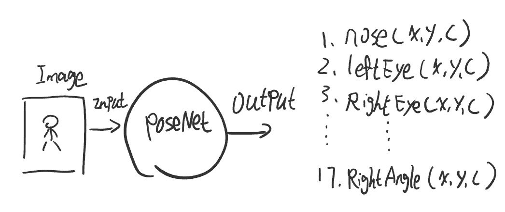
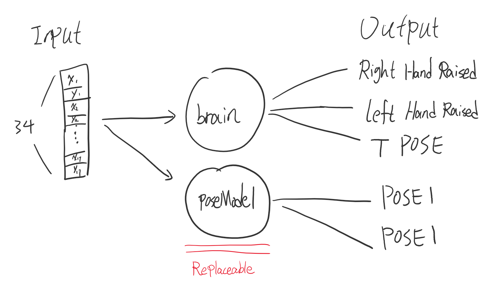

# teamPro_posenet
 Home Training App [README_ENG](README_ENG.md)
 
 本项目主要参考了The Coding Train中的poseNet系列的示例教程，以下是系列视频的[链接](https://www.youtube.com/watch?v=OIo-DIOkNVg)

 对poseNet有一定了解后就可以利用poseNet进行很多有意思的前端开发。本项目也是其中之一。
 其中使用到的ml5.js库是基于Tensorflow.js的，能在浏览器上进行机器学习的相关开发的开源框架。
 同时搭配p5.js绘图框架能很好的展示视频图像和绘制poseNet的人体骨架结果。
 ## 目录
 * [1. 项目安装](#1)

 * [2. 使用说明](#2)

 * [3. 项目说明](#3)

   * [a. 主要说明](#31)
   * [b. 项目结构](#32)
   * [c. 动作计数功能实现部分](#33)
   * [d. 可替换的poseModel](#34)
   * [e. 模型训练阶段的使用手册](#35)
 * [4. 未来计划](#4)

<h2 id="1">1. 项目安装</h2>
 
 1. 使用npm安装相关依赖后使用 npm start的方式

<h2 id="2">1. 使用说明</h2> 
程序主要分为两个状态，一是加载了poseModel的‘可进行运动状态’，二是没有加载poseModel的‘需训练poseModel模型状态’。简单来说如果加载了poseModel就能直接开始动作计数功能，没有poseModel则需要先训练一个分类模型才能进行动作计数功能。

 1. 打开页面后会请求设备摄像头权限，允许之后自动开启姿势识别。
 
 2. 把摄像头设备放于地面，尽量让整个身体出现在画面中。摄像头如下图角度：

 </img>

 3. 首先默认会加载一个poseModel模型，可以用来计数做了几个深蹲。
 4. 根据画面左上角的提示，可以同摆不同的姿势来下达相应的指示，能下达指令的姿势是提前定义好的，是训练好的brain模型的输出。
 5. 若想自己实现brain分类模型，可参考下面The Coding Train的[链接](https://www.youtube.com/watch?v=OIo-DIOkNVg)
 6. 训练poseModel阶段的使用说明可参考[下方说明](#35)
 <h2 id="3">3. 项目说明</h2>

 <h3 id="31"> a. 主要说明</h3>

 本项目主要功能是通过设备的摄像头，给在家里运动的人提供对动作的计数功能。 
<h3 id="32"> b. 项目结构</h3>

 首先从poseNet系列教程也可以知道poseNet的输入是一张图片，输出是17个人体关节点的像素坐标和置信度

 取每个关节的的x和y值组成一个长度为34的数组作为后面姿势分类模型的输入，下图是姿势分类模型的结构。

 从图中可以看出有一个叫brain的分类模型，另外一叫poseModel的2分类模型。
 其中brain分类模型的输出用于下达命令，例如：当我举起右手,进入'训练'状态，举起左手就暂停训练。当然这些规则是我自己定义的，你也可以创造自己方式。[(参考The Coding Train的poseNet系列视频)](https://www.youtube.com/watch?v=OIo-DIOkNVg),国内的朋友在b站也能找到相关视频

<h3 id="33"> c. 动作计数功能实现部分</h3>

 重要的是poseModel二分类模型，这个模型虽然简单，但是是实现动作计数功能的核心部分。简单来说计数的算法是：从姿势一变化到姿势二，计数增加0.5， 姿势二变回姿势一，计数在增加0.5。 一点不难吧。

</img>    </img>

其它方式：

1. 实现姿势计数这个部分我参考过其它项目，其中有一篇值得推荐的文章，利用opencv的optical flow的算法+图片分类模型实现的动作计数功能，有兴趣的朋友以下是[gitHub链接](https://github.com/artkulak/workout-movement-counting)

2. 对于动作计数这个部分我最初的想法是通过关节点坐标的实时变化，计算出坐标值的变化量，找出坐标值周期性变化的规律，训练一个模型来判断当前动作状态，输入是34个值的变化量，输出是状态1(up-ing)，状态2(down-ing)，状态3（转折点）。 但由于能力有限，目前为止只是对有监督学习有了解，因此对每个时刻进行标记的工作有点大量了。或许是没找到好的标记方式。除此之外，设想可以利用无监督学习或者半监督学习的发现实现这个想法，不过是以后的事情了。

<h3 id="34"> d. 可替换的poseModel</h3>

 默认加载的poseModel二分类模型是对深蹲动作的两个状态进行分类判断，从而实现计数功能。这种情况下若是我做俯卧撑或者其它动作的话，模型就不一定能进正确的判断了。
 那我要换个动作来计数怎么办？这个时候你就可以训练一个新的二分类模型（把俯卧撑的动作分解成两个状态进行分类训练）然后替换原来的poseModel就行。
 
 多亏ml5.js机械学习框架，可以把模型搭建训练过程极度简化。我们把模型训练分为3个阶段。
 
 * 阶段一： 动作状态一的数据收集阶段(POSE1)
 
 *  阶段二： 动作状态二的数据收集阶段(POSE2)
 
 * 阶段三： 模型训练阶段

 这个时候brain模型就能发挥他另一个作用了，每个姿势在不同阶段可以下达不同的命令

<h3 id="35"> e. 模型训练阶段的使用手册</h3>

 下面是我定义的命令，相当于训练模型的使用手册了吧。

 阶段一： (动作状态一的数据收集阶段)

* 举起右手：动作识别成功后，倒计时4秒后开始收集姿势一(POSE1)的数据，收集时间为5秒。收集完成后可以再次举起右手收集数据。
 
 * 举起左手：动作识别成功后，进入模型训练第二阶段

 * T POSE: 动作识别成功后，删除收集数据重新回到阶段一数据收集阶段

阶段二：(动作状态二的数据收集阶段)

* 举起右手： 动作识别成功后，倒计时4秒后开始收集姿势二(POSE2)的数据

* 举起左手：动作识别成功后，进入模型训练第三阶段，并自动开始训练模型

 * T POSE: 动作识别成功后，删除收集数据重新回到阶段一数据收集阶段

阶段三： (模型训练阶段)

 * 举起右手：poseModel模型训练完成后，进入训练阶段
 
 * 举起左手：训练完成后，保存poseModel模型

 * T POSE: 删除现有poseModel模型，重新训练poseModel模型

<h2 id="4"> 4. 未来计划</h2>
 
1. 利用vue.js进行前端应用的界面的设计

2. 为了不用每次换训练动作都要先训练一次poseModel模型，计划搭建服务器和链接MongoDb，建立一个能储存用户训练好的poseModel分类模型的数据库。用户登录后可以选择自己之前保存好的各个动作的二分类poseModel模型。

 

