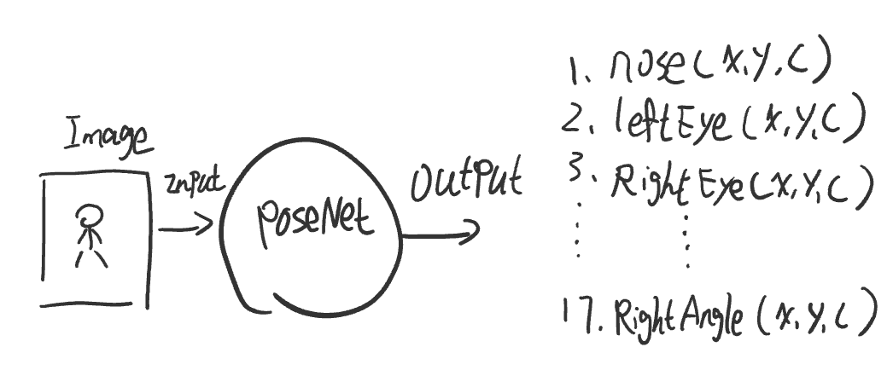
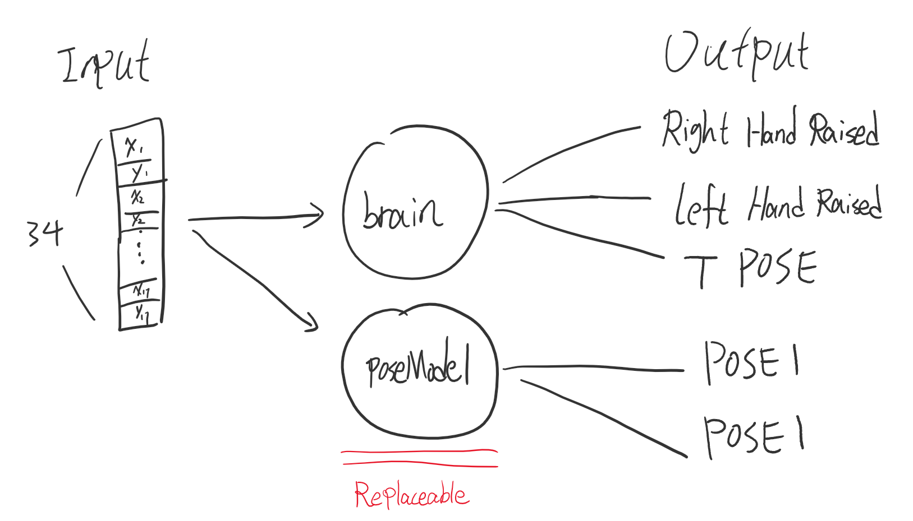

# teamPro_posenet 
Home Training App [README_中文](README.md)

This project mainly refers to the poseNet series of sample tutorials in The Coding Train. The following is the [link](https://www.youtube.com/watch?v=OIo-DIOkNVg) of the poseNet series 

After a certain understanding, you can use poseNet for many interesting front-end developments. This project is also one of them. The ml5.js library used is based on Tensorflow.js, an open-source framework for machine learning related development on the browser. At the same time, with the p5.js drawing framework, it can display video images and draw the results of PostNet's human skeleton. 

## Table of Contents
 * [1. Project Installation](#y1)
 * [2. Instructions for Use](#y2) 
 * [3. Project Description](#y3) 
    * [3.1. Main Description](#y31) 
    * [3.2 Project structure](#y32) 
    * [3.3. Implementation of action counting algorithm](#y33) 
    * [3.4. Replaceable poseModel](#y34) 
    * [3.5. Manual for model building state](#y35) 
* [4. Future plans](#y4)

<h2 id=y1> 1. Project installation  </h2>

1. git clone git@github.com:neng5201314/teamPro_posenet.git

2. cd poseNet_git

3. npm install

4. npm start

<h2 id=y2> 2. Instructions for Use  </h2>

The program is mainly divided into two states, one is the "workout state" with poseModel loaded, and the other is the "poseModel building state" without poseModel loaded. Simply, if you load a poseModel, you can start the action counting function directly. Without a poseModel, you need to train a classification model to perform the action counting function. 

1. After opening the page, it will request the device camera permission, and then automatically turn on the gesture recognition. 

2. Put the camera device on the ground, try to make the whole body appear in the picture. The camera angle is as follows: 

</img>

3. First, a poseModel model will be loaded by default, which can be used to count how many squats have been done. 

4. According to the prompt on the upper left corner of the screen, you can give corresponding instructions in different postures. The posture that can give instructions is defined in advance and is the output of the trained model called 'brain'. 

5. If you want to implement the 'brain' classification model by yourself, please refer to the [link](https://www.youtube.com/watch?v=OIo-DIOkNVg) of The Coding Train  

6. Instructions on buliding poseModel state, please refer to [3.5 Manual for model building state](#35)

<h2 id=y3> 3. Project Description  </h2>
 
 <h3 id="y31"> 3.1. Main description</h3>

 The main function of this project is to provide movement counting function for people exercising at home through the device's camera. 
 
 <h3 id="y32">  3.2. Project structure </h3>

 First of all, from the poseNet series of tutorials, you can also know that the input of poseNet is a picture, and the output is the pixel coordinates and confidence of the 17 human joint points
 
  
 
 Take the x and y values ​​of each joint to form an array of length 34 as the input of the pose classification model. The following figure shows the structure of the pose classification model.

  
 
 As can be seen from the figure, there is a classification model called brain, and another two-classification model called poseModel. The output of the brain classification model is used to issue commands. For example, When I raise my right hand, I enter the'training' state, and when I raise my left hand, I pause training. Of course these rules can defined by youself, you can also create your own way. [(Refer to the poseNet series of videos of The Coding Train)](https://www.youtube.com/watch?v=OIo-DIOkNVg)
 
 <h3 id="y33">   3.3. Implementation of action counting algorithm </h3>

 The important thing is the poseModel, whict is a two-category model. Although this model is simple, it is the core part of the action counting function. In simple terms, the counting algorithm is: from posture one to posture two, the count increases by 0.5, posture two changes back to posture one, and the count increases by 0.5.

 Other ways:

 1. I have referred to many other projects in this part of implementing posture counting. Among them, there is an article worth recommending, using opencv's optical flow algorithm + image classification model to implement the action counting function. Friends who are interested, refer to [gitHub Link](https://github.com/artkulakworkout-movement-counting)

 2. For the part of action counting, my initial idea is to calculate the change of coordinate value through the real-time change. Then, find out the pattern of periodic change of coordinate value, and train the model to determine the state of the current action. The input is the amount of change of 34 values. The output is state 1 (up-ing), state 2 (down-ing), state 3 (turning point). However, due to limited capabilities, so far only has an understanding of supervised learning, so there is a lot of work to labeling every moment of action. Perhaps there is a good labeling method I can not found. In addition, it is envisaged that this idea can be implemented by using the discoveries of unsupervised learning or semi-supervised learning, but it is a future thing.
 
 <h3 id="y34">  3.4. Replaceable poseModel </h3>
 
 The two-category poseModel model loaded by default, which can  classify the two states of the squat action, so as to realize the counting function. In this case, if I do push-ups or other actions, the model may not be able to make a correct judgment.
 What should I do if I have to change the movement to count? At this time, we need a replaceable poseModel. You can train a new poseModel model (decompose the push-up action into two states for classification training) and then replace the original poseModel. Thanks to the ml5.js mechanical learning framework, the model building training process can be extremely simplified. We divide the model training into 3 stages. 
 * Phase 1: The data collection phase of the action state 1 (POSE1) 
 * Phase 2: The data collection phase of the action state 2 (POSE2) 
 * Phase 3: The model training phase 
 
 At this time, the brain model can play another role, each Different commands can be issued in different posture. 
 
 <h3 id="y35">  3.5. Manual for model training state </h3>
 
 Below is the command I defined. It can be regarded as a manual for Model building state.

 Phase 1: (Data collection phase of action status 1)

 * Raise the right hand: start collecting data of posture 2 (POSE2) after 4 seconds of countdown, and the collection time is 5 seconds.
 
 * Raise your left hand: After successful action recognition, enter phase2, the second stage of model training 
 
 * T POSE: Delete the collected data and return to the first data collection stage

 Phase 2: (Data Collection Phase of Action State 2)

 * Raise your right hand: start collecting data of posture 2 (POSE2) after 4 seconds of countdown, and the collection time is 5 seconds.

 * Raise your left hand: 
 enter phase 3, the third stage of model training, and automatically start training the model 

 * T POSE: After successful action recognition, delete the collected data and return to the first stage of data collection

 Stage 3: (Model training stage) 

 * Raise your right hand: After the poseModel model training is completed, enter the workout stage

 * Raise your left hand: After the training is completed, save the poseModel model 
 
 * T POSE: Delete the existing poseModel model and retrain the poseModel model 
 
 4. Future plan 
<h2 id=y4> 4. Future plan  </h2>

 1. Use vue.js to design the front-end application interface

 2. In order not to train the poseModel model every time you change the workout action, we plan to build a server and link to MongoDb(noSQL). Build a database that can store the poseModel classification models trained by users. After logging in, the user can select the two-category poseModel model of each action saved before.
